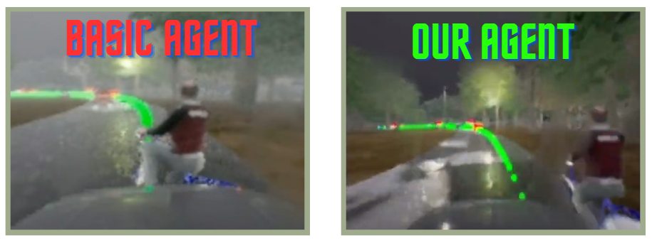
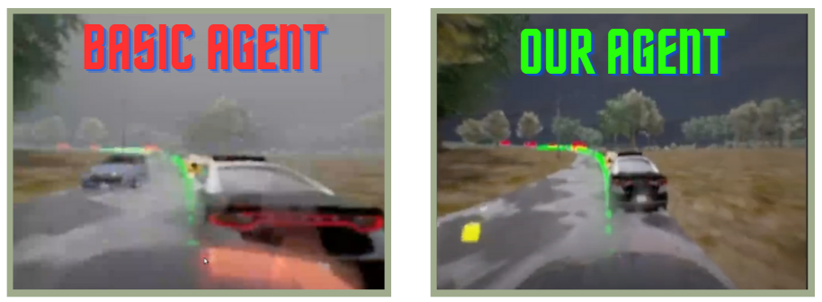
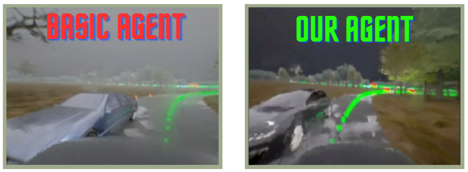
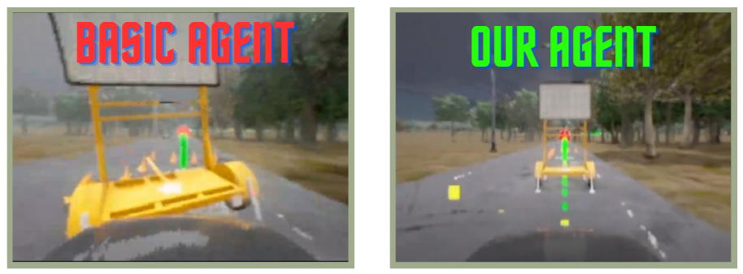
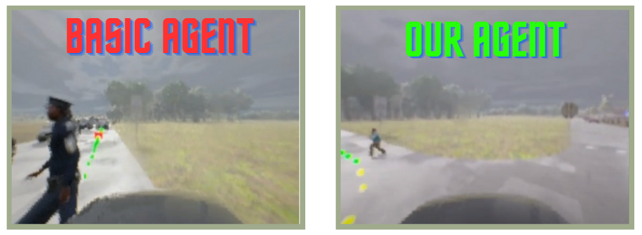

# Progetto di Guida Autonoma con Simulatore Carla

## Introduzione

Questo progetto universitario si concentra sullo sviluppo e miglioramento di un agente di guida autonoma utilizzando il simulatore Carla. Partendo da un agente base con capacità limitate, il nostro obiettivo è stato potenziare le sue capacità per affrontare scenari stradali complessi.

## Descrizione del Progetto

Abbiamo inizialmente implementato diverse logiche di guida basate sulle informazioni percepite dall'ambiente simulato in Carla. Queste logiche includono la gestione di biciclette, il sorpasso dei veicoli parcheggiati, la navigazione in intersezioni, e la reazione a ostacoli come coni stradali, situazioni non affrontate dall'agente base.

## Confronto tra l’Agente Base e l’Agente Finale

Nella seguente sezione, esamineremo e confronteremo i risultati ottenuti dall’agente base e dall’agente finale in due scenari distinti.

### Esempi di Comportamento tra come era prima e come è adesso l'agene

- **Figura 1:** In questo scenario, l'agente base si scontra con la bici, mentre il nostro agente riesce a manovrare per evitarlo.
  

- **Figura 2:** In questo scenario, l'agente base non riesce a effettuare sorpassi in presenza di veicoli fermi, mentre il nostro agente si riesce a trovare un percorso alternativo per il sorpasso.
  

- **Figura 3:** In questo scenario, l'agente base non gestisce correttamente i coni sulla corsia opposta, mentre il nostro agente riesce a gestire la situazione.
  

- **Figura 4:** L'agente base non riesce a gestire ostacoli come i warning traffic, mentre il nostro agente, come per i blocchi stradali, trova percorsi alternativi per il sorpasso.
  

- **Figura 5:** In questo scenario, l'agente base non riesce a gestire i pedoni in curva, mentre il nostro agente riesce a frenare anticipatamente.
  

## Conclusione

Il nostro lavoro ha portato alla creazione di un agente più robusto e versatile, capace di affrontare un'ampia gamma di scenari stradali con comportamenti di guida sicuri. Per ulteriori dettagli e risultati, consultare il documento completo del progetto (paper.pdf).

